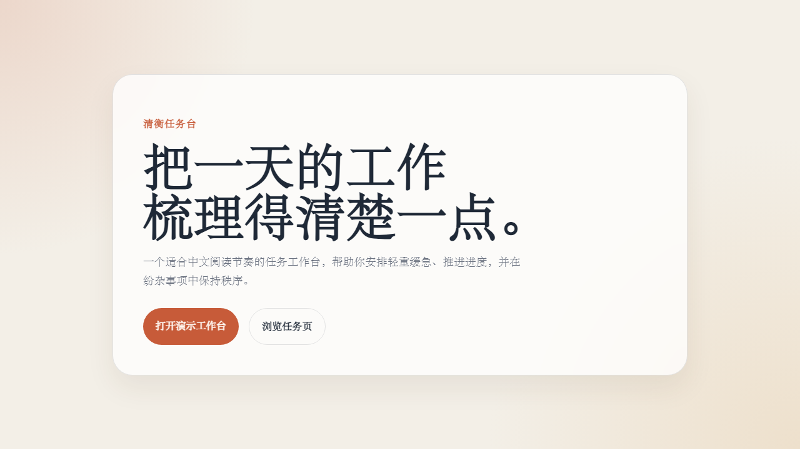

# 清衡任务台 TaskFlow

一个围绕中文阅读节奏设计的任务工作台。它把任务管理、到期风险、标签组织、进度趋势和个人资料整合到同一个前端项目里，适合作为个人作品集中的主项目继续打磨。

## 在线地址

- 生产部署：[https://fronted-flame-five.vercel.app](https://fronted-flame-five.vercel.app)
- Vercel Inspector：[https://vercel.com/uonlrasnaeys-projects/fronted/4NeHUqL6qPE7mpf8XeC9FahxZJeL](https://vercel.com/uonlrasnaeys-projects/fronted/4NeHUqL6qPE7mpf8XeC9FahxZJeL)

说明：

- 当前项目已经成功部署到 Vercel。
- 如果你还没有在 Vercel 项目设置里补上 Supabase 环境变量，线上站点会以演示模式运行。
- 本地 `.env.local` 已接入真实 Supabase；线上若要使用真实认证和真实任务数据，需要在 Vercel 项目中同步配置相同环境变量。

## 展示截图

### 首页



### 仪表盘


### 任务页


### 设置页


截图文件位于：

- [landing.png](D:\Studys\Projects\fronted\docs\screenshots\landing.png)
- [dashboard.png](D:\Studys\Projects\fronted\docs\screenshots\dashboard.png)
- [tasks.png](D:\Studys\Projects\fronted\docs\screenshots\tasks.png)
- [settings.png](D:\Studys\Projects\fronted\docs\screenshots\settings.png)

## 项目亮点

- 中文宋体风格的阅读型界面和统一排版节奏
- Next.js App Router 架构
- Supabase Auth + Profiles + Tasks 的真实数据链路
- Dashboard 支持 URL 同步时间范围
- Tasks 页面支持 URL 同步筛选条件
- 本地持久化与远程数据模式平滑切换
- 任务标签系统
- 到期、今天到期、逾期风险提示
- Dashboard 图表模块：完成趋势、状态分布、标签分布

## 核心功能

### 认证与身份

- 注册 / 登录
- 个人资料编辑
- 头像地址与昵称展示
- 服务端鉴权保护 Dashboard 路由

### 任务系统

- 新建、编辑、删除任务
- 状态切换
- 优先级管理
- 标签系统
- 截止日期与风险提示
- 任务详情页

### 列表与筛选

- 搜索
- 标签筛选
- 状态筛选
- 优先级筛选
- 排序
- URL 参数同步

### Dashboard

- 概览统计卡片
- 即将到期提醒
- 进度概览
- 最近活动流
- 标签摘要
- 完成趋势图
- 状态分布图
- 标签分布图

## 技术栈

- Next.js 16
- React 19
- TypeScript
- Supabase
- React Hook Form
- Zod
- Zustand
- Vercel

## 目录概览

```txt
src/
  app/
  components/
    auth/
    dashboard/
    layout/
    task/
  features/
    auth/
    tasks/
  lib/
    supabase/
  providers/
  store/
  mock/

supabase/
  tasks.sql

docs/
  screenshots/
```

## 本地启动

1. 安装依赖

```bash
corepack pnpm install
```

2. 启动开发环境

```bash
corepack pnpm dev
```

3. 打开浏览器

```txt
http://localhost:3000
```

如果 3000 被占用，Next.js 会自动切换到其他端口。

## 环境变量

在项目根目录创建 `.env.local`：

```bash
NEXT_PUBLIC_SUPABASE_URL=你的 Supabase Project URL
NEXT_PUBLIC_SUPABASE_PUBLISHABLE_KEY=你的 Supabase Publishable Key
```

## Supabase 初始化

1. 打开 Supabase Dashboard
2. 进入当前项目
3. 打开 `SQL Editor`
4. 新建查询
5. 执行 [tasks.sql](D:\Studys\Projects\fronted\supabase\tasks.sql)

这份 SQL 会创建或补齐：

- `profiles` 表
- `tasks` 表
- `tags` 字段
- `updated_at`
- `completed_at`
- RLS policy
- 用户注册后自动创建 profile 的 trigger
- 任务更新时间 trigger

如果你之前已经执行过旧版 SQL，也建议重新执行最新版一次，确保 `tags` 等新增字段已经补齐。

## Vercel 部署

这次已经通过 CLI 成功部署。

部署结果：

- Project：`fronted`
- Team：`uonlrasnaey's projects`
- Production URL：[https://fronted-flame-five.vercel.app](https://fronted-flame-five.vercel.app)

如果你要让线上站点接入真实 Supabase，而不是演示模式，请到 Vercel 项目中补环境变量：

1. 打开 Vercel 项目 `fronted`
2. 进入 `Settings`
3. 进入 `Environment Variables`
4. 添加：

```bash
NEXT_PUBLIC_SUPABASE_URL=...
NEXT_PUBLIC_SUPABASE_PUBLISHABLE_KEY=...
```

5. 重新触发部署

## 当前适合作为作品展示的页面

- `/`
- `/dashboard`
- `/tasks`
- `/tasks/[id]`
- `/settings`

## 下一步路线

- 给任务系统增加子任务与备注
- 给 Dashboard 增加更细的时间筛选与导出能力
- 上传头像而不只是填 URL
- 补 README 中的技术架构图和数据流图
- 增加 Vercel 环境变量后的线上真实联调说明

## 开发说明

这个项目目前已经具备：

- 真实 Supabase 接入能力
- 完整的任务 CRUD
- 作品级的 Dashboard 和展示页面

从这里继续往下做，最自然的方向已经不再是“从 0 开始搭”，而是“持续把它打磨成一个更完整的产品作品”。
