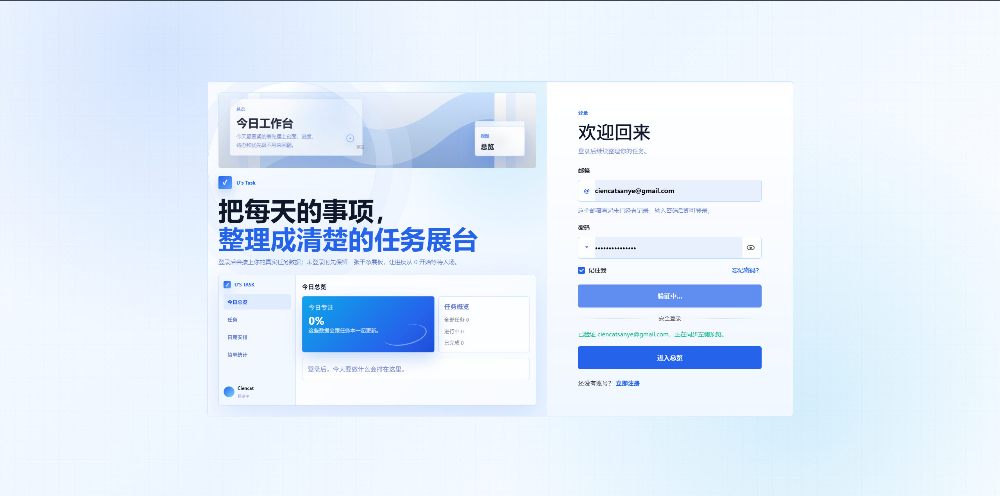
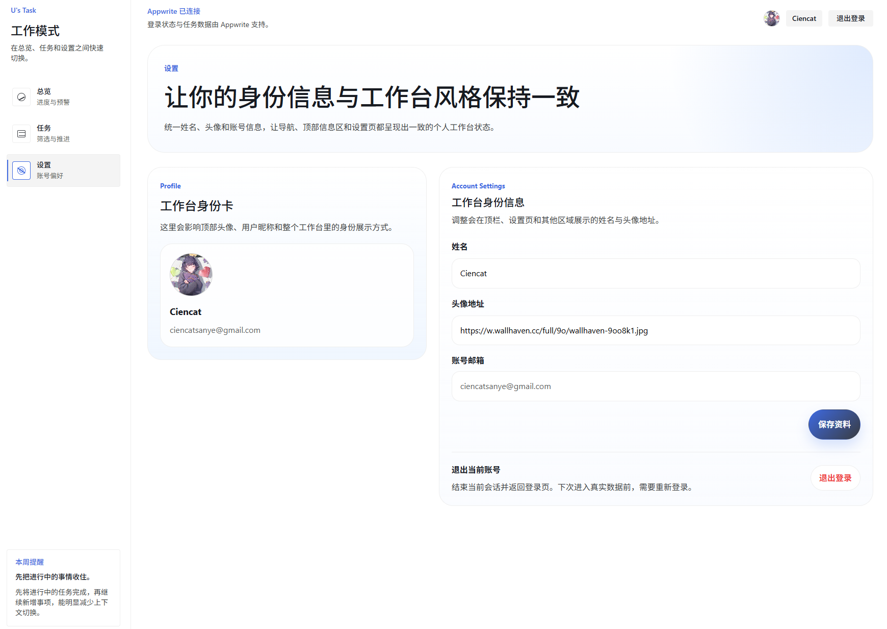

# TaskFlow

TaskFlow 是一个偏个人任务本风格的小应用，用来把任务记录、筛选排序、截止提醒和进度总览放到同一个地方。

这个项目最初想解决的问题很简单：事情一多，就不只是“记下来”这么简单了，还需要知道哪些任务快到期、哪些正在推进、最近完成了多少，以及接下来应该先看哪一批。TaskFlow 目前已经接入 Appwrite，可以跑真实账号和真实任务数据；没有配置后端时，也会自动退回本地演示模式，方便直接打开看看。

## 在线预览

- 公开演示页：[https://taskflow.vercel.app/demo](https://raskflow.vercel.app/demo)
- 应用入口：[https://www.uta4k.top/](https://www.uta4k.top/login)
- 项目文章：[https://www.uon1ra.top/article/taskflow](https://www.uon1ra.top/article/taskflow)

> `/demo` 是公开演示页，不需要登录，也不会读取真实账号数据。`/` 会尝试进入工作台；如果当前没有登录，会跳转到登录页。

## 公开演示页

如果只是想先看界面和功能手感，直接访问：

```txt
http://localhost:3000/demo
```

演示页使用 `src/mock/tasks.ts` 中的本地 mock 数据，展示：

- 任务统计卡片
- 完成趋势
- 状态分布
- 标签摘要
- 快到期任务
- 最近活动
- 任务样例卡片

它和真实工作台的区别：

- 不需要登录
- 不请求 Appwrite
- 不会创建、编辑或删除真实任务
- 不会展示任何真实用户数据
- 适合用于公开预览、截图和移动端展示

## 项目截图

| 首页 | 总览 |
| --- | --- |
|  |  |

| 任务列表 | 设置页 |
| --- | --- |
|  |  |

## 主要功能

- 邮箱注册、登录、退出登录，以及基于 `httpOnly` cookie 的会话保持
- 任务创建、编辑、删除、状态切换和详情查看
- 按关键词、标签、状态、优先级筛选任务
- 按截止日期、创建时间、更新时间和优先级排序
- 总览支持今天、本周、全部三个观察范围，并同步到 URL
- 任务列表筛选条件同步到 URL，刷新或分享链接后仍能还原视图
- 统计卡片、完成趋势、状态分布、标签分布、近期活动和即将到期提醒
- 逾期、今天到期、3 天内到期等截止风险提示
- 个人资料设置，支持昵称和头像地址更新
- Appwrite 真实数据模式和 localStorage 演示模式自动切换
- `/demo` 公开演示页，可在未登录状态下查看 mock 数据工作台

## 技术栈

- Next.js App Router
- React
- TypeScript
- Appwrite
- React Hook Form
- Zod
- Zustand
- Vercel

## 实现思路

项目的核心边界是让浏览器只和当前站点的 Next.js API 通信，再由服务端 API 去访问 Appwrite。这样可以把 Appwrite API Key 留在服务端，同时用站点自己的 `httpOnly` cookie 管理登录态。

任务数据在 Appwrite 中开启了 row-level permissions，每条任务只给当前用户读写权限。前端侧使用 Zustand 管理任务状态：配置了 Appwrite 时会同步远程数据；没有配置时则使用 localStorage 承接演示数据。这样项目既能作为完整应用运行，也不会因为缺少后端配置而直接空掉。

项目里我比较在意的几个点：

- 页面状态尽量可恢复：总览范围和任务筛选都放进 URL。
- 任务不只是列表：截止日期、优先级、状态和标签会一起参与排序与提示。
- 后端可选但体验不断：没有 Appwrite 时仍然能看完整界面和主要交互。
- 组件按页面领域拆分：认证、任务、总览、布局和设置各自独立，后续扩展会比较清楚。

## 目录结构

```txt
src/
  app/                  # App Router 页面与 API Route
  components/           # 页面组件和通用 UI
  features/             # 领域类型、schema 和工具函数
  lib/appwrite/         # Appwrite 环境、会话和任务数据适配
  mock/                 # 演示数据
  providers/            # Auth / Toast 等全局能力
  store/                # Zustand task store

docs/
  screenshots/          # README 使用的页面截图
  appwrite-setup.md     # Appwrite 配置说明
```

## 本地运行

先安装依赖：

```bash
corepack enable
pnpm install
```

复制环境变量文件：

```bash
cp .env.example .env.local
```

如果只是看公开演示页，可以先不填 Appwrite，直接访问 `/demo`。要跑真实账号和真实任务数据，需要补充这些变量：

```bash
NEXT_PUBLIC_APPWRITE_ENDPOINT=https://sgp.cloud.appwrite.io/v1
NEXT_PUBLIC_APPWRITE_PROJECT_ID=xxx
APPWRITE_API_KEY=xxx
APPWRITE_DATABASE_ID=xxx
APPWRITE_TASKS_TABLE_ID=xxx
APPWRITE_SESSION_COOKIE_NAME=taskflow-session
NEXT_PUBLIC_SITE_URL=http://localhost:3000
```

线上部署时，`NEXT_PUBLIC_SITE_URL` 必须换成真实域名，例如：

```bash
NEXT_PUBLIC_SITE_URL=https://www.uta4k.top
```

这个值会用于 Appwrite 邮箱验证回调链接。如果线上环境仍然写成 `http://localhost:3000`，邮箱里的确认链接会指向本机地址，离开本地开发服务器后就会打不开。

启动开发环境：

```bash
pnpm dev
```

浏览器打开：

```txt
http://localhost:3000/demo
```

如果打开 `http://localhost:3000`，应用会尝试进入 `/dashboard`；在 Appwrite 已配置但未登录时，会自动跳转到 `/login`。

构建生产版本：

```bash
pnpm build
pnpm start
```

## Appwrite 配置

Appwrite 需要完成以下配置：

1. 创建 Appwrite Project
2. 添加本地和线上 Web Platform
3. 开启 Email / Password 登录方式
4. 创建 Database
5. 创建 `tasks` table
6. 开启 Row security
7. 创建服务端 API Key
8. 在本地 `.env.local` 或 Vercel 环境变量中填入对应配置

`tasks` table 的字段、权限和 profile 存储方式可以看这份说明：[docs/appwrite-setup.md](docs/appwrite-setup.md)。

## 页面路由

- `/`：应用入口，会尝试进入工作台
- `/demo`：公开演示页，使用 mock 数据，不需要登录
- `/login`：登录
- `/register`：注册
- `/dashboard`：任务总览
- `/tasks`：任务列表
- `/tasks/[id]`：任务详情
- `/settings`：个人设置

## 当前状态

目前已经完成从本地演示数据到 Appwrite 真实数据的主链路联调，包含：

- 未登录访问受保护页面会跳转到登录页
- 注册、登录、退出登录
- 读取当前用户信息
- 更新个人资料
- 创建、读取、更新和删除任务
- 总览和任务列表在真实数据下正常同步

## 后续计划

- 给任务增加子任务或备注
- 支持头像上传，而不只是填写图片 URL
- 增加任务导出能力
- 给总览补更多时间维度
- 整理旧兼容字段，让 Appwrite table schema 更干净

