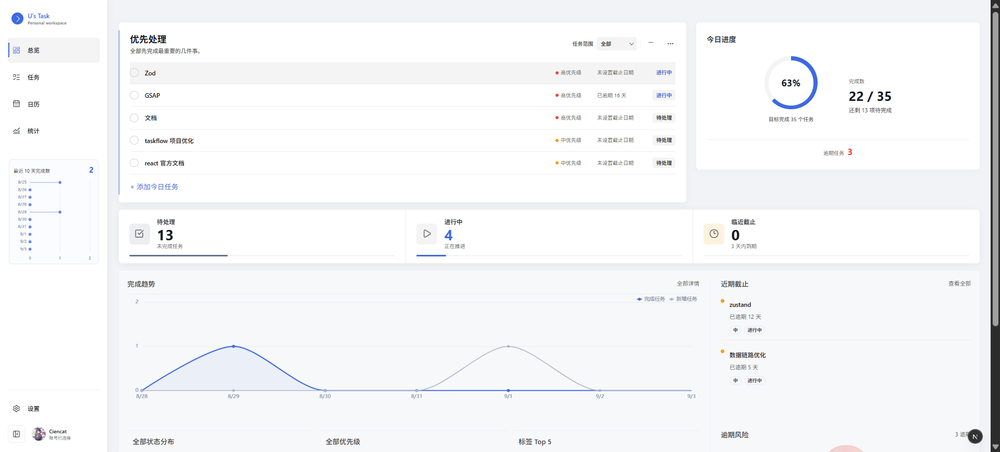
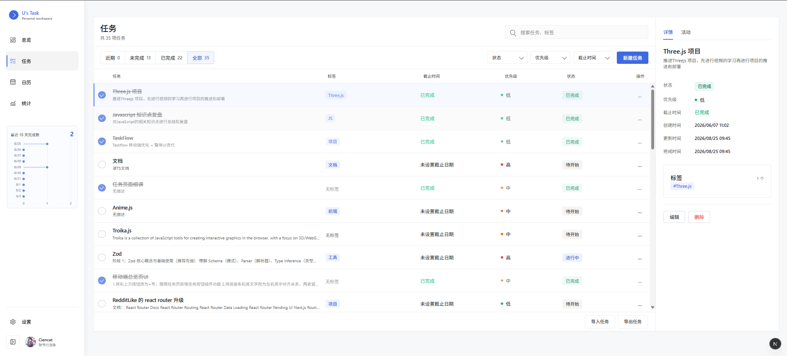
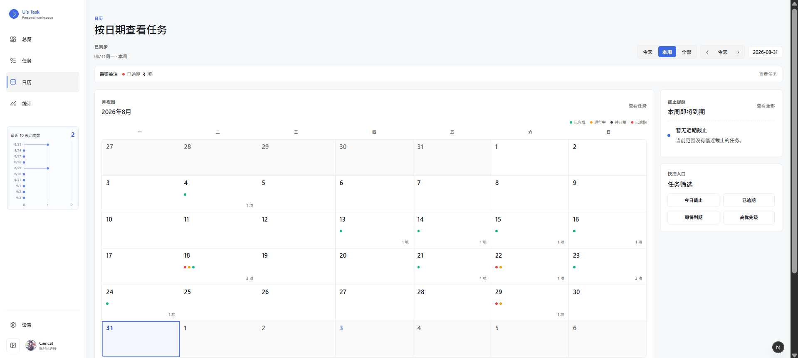
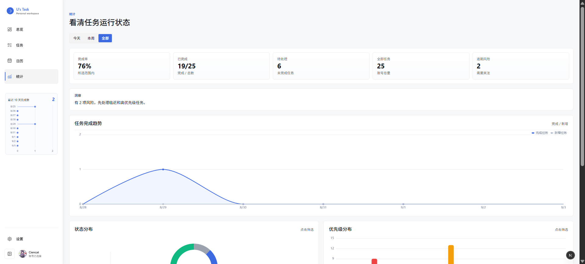
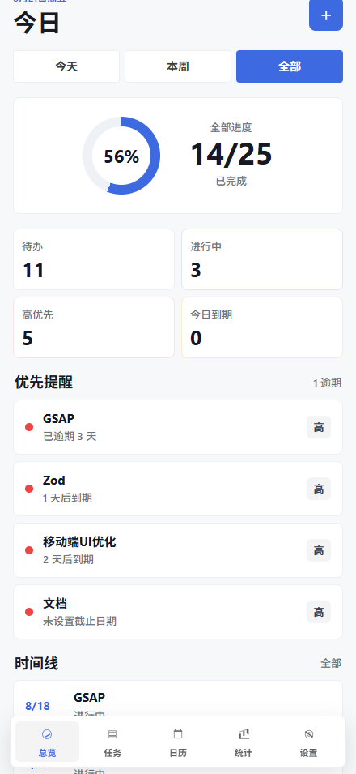
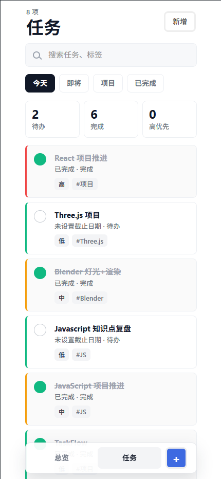
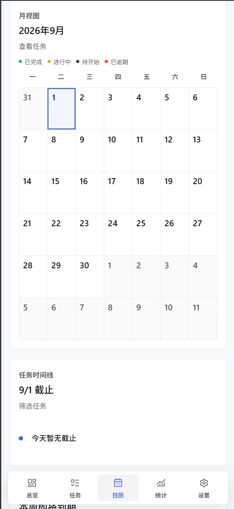
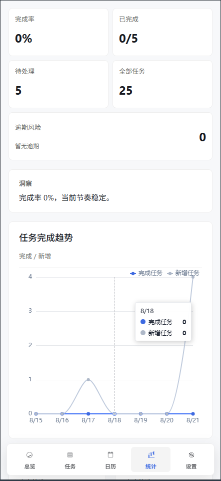
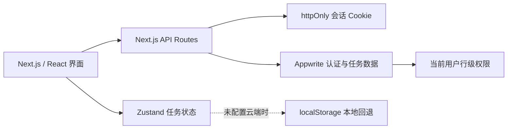

# TaskFlow

> 一个围绕个人当下规划和下一步行动设计的个人任务工作台。

<p align="center">
  <a href="https://www.uta4k.top/"></a>
  <a href="https://github.com/Uonlra/TaskFlow"></a>
  <a href="LICENSE"></a>
  
  
  
</p>

TaskFlow 将任务记录、截止风险、进度统计和可恢复筛选汇集到一个轻量工作台中。它面向需要持续处理学习、工作和个人事务的用户：打开页面即可知道今天该做什么、哪些事项即将到期，以及整体推进情况。

**在线预览：** [www.uta4k.top](https://www.uta4k.top/)

**项目主页：** [github.com/Uonlra/TaskFlow](https://github.com/Uonlra/TaskFlow)

## 项目亮点

- TaskFlow 不把任务仅仅当作静态条目。系统会结合截止日期、完成状态和优先级，为今天到期、未来三天到期和逾期任务提供清晰提示；总览、日历和统计页从不同视角帮助用户判断下一步工作重点。

- 任务页与总览页会将关键筛选条件和时间范围同步到 URL。刷新页面、复制链接或在不同页面间往返时，当前工作视图不会丢失，适合将任务列表作为持续使用的工作界面。

- 桌面端提供适合扫描、筛选和批量查看的工作台布局；移动端则收紧信息层级，统一日期切换和快捷筛选操作，让查看今日事项与临近任务保持直接。

- 配置 Appwrite 后，项目提供邮箱认证和真实任务数据同步；没有后端公共配置时，任务状态自动回退至 `localStorage`，便于本地体验和快速演示。

- 浏览器只与 Next.js API Routes 通信，Appwrite API Key 保留在服务端。会话通过 `httpOnly` Cookie 保存，任务表的行级权限限制为当前用户自身数据，从架构上缩小客户端暴露面。

## 界面预览

### 桌面端

| 总览                                                   | 任务工作台                                             |
| ------------------------------------------------------ | ------------------------------------------------------ |
|  |  |

| 日历                                                  | 统计                                         |
| ----------------------------------------------------- | -------------------------------------------- |
|  |  |

### 移动端

| 总览                                                     | 任务工作台                                             |
| -------------------------------------------------------- | ------------------------------------------------------ |
| _ |  |

| 日历                                                    | 统计                                                |
| ------------------------------------------------------- | --------------------------------------------------- |
| _ |  |

## 功能一览

- 邮箱注册、登录、退出和会话保持
- 创建、编辑、删除、完成及查看任务详情
- 通过关键词、标签、状态、优先级和排序规则定位任务
- 任务快捷筛选：今天、临近截止、未完成、已完成
- 总览统计、完成趋势、状态与标签分布、近期活动
- 逾期、当天到期及未来三天截止提醒
- 日历视图与个人资料设置
- Appwrite 云端数据与 `localStorage` 本地回退

## 架构概览



## 技术栈

| 范畴       | 选型                                                  |
| ---------- | ----------------------------------------------------- |
| 应用框架   | Next.js 16（App Router）、React 19、TypeScript 6      |
| 表单与状态 | React Hook Form、Zod、Zustand                         |
| 数据与认证 | Appwrite、Next.js API Routes、`httpOnly` Cookie       |
| 可视化     | ECharts、anime.js                                     |
| 质量保障   | Vitest、Testing Library、Playwright、ESLint、Prettier |
| 包管理     | pnpm 10.7.0                                           |

## 快速开始

### 环境要求

- Node.js 22 或更高版本
- pnpm 10.7.0（建议通过 Corepack 启用）

### 安装与启动

```bash
corepack enable
pnpm install
Copy-Item .env.example .env.local
pnpm dev
```

启动后访问 [http://localhost:3000](http://localhost:3000)。在 PowerShell 中使用上述复制命令；macOS 或 Linux 可改为：

```bash
cp .env.example .env.local
```

### 配置 Appwrite（可选）

将以下值填入 `.env.local`，即可启用真实账户和任务数据：

```dotenv
NEXT_PUBLIC_APPWRITE_ENDPOINT=https://sgp.cloud.appwrite.io/v1
NEXT_PUBLIC_APPWRITE_PROJECT_ID=xxx
APPWRITE_API_KEY=xxx
APPWRITE_DATABASE_ID=xxx
APPWRITE_TASKS_TABLE_ID=xxx
APPWRITE_SESSION_COOKIE_NAME=taskflow-session
NEXT_PUBLIC_SITE_URL=http://localhost:3000
```

`APPWRITE_API_KEY` 仅供服务端使用，绝不能添加 `NEXT_PUBLIC_` 前缀，也不应提交到版本库。未配置 Appwrite 的公开变量时，应用将以本地存储模式运行。

在 Appwrite 中创建 `tasks` 表后，请启用 Row Security，并确保每条任务仅授予创建者读、更新和删除权限。

## 常用命令

| 命令                 | 用途                     |
| -------------------- | ------------------------ |
| `pnpm dev`           | 启动开发服务器           |
| `pnpm build`         | 生成生产构建             |
| `pnpm start`         | 启动生产服务器           |
| `pnpm lint`          | 执行代码检查             |
| `pnpm format:check`  | 检查格式                 |
| `pnpm typecheck`     | 执行 TypeScript 类型检查 |
| `pnpm test`          | 运行单元与组件测试       |
| `pnpm test:coverage` | 生成测试覆盖率           |
| `pnpm test:e2e:mock` | 运行 Mock 端到端测试     |

## 质量保障

项目的 GitHub Actions 会在推送和拉取请求中自动执行 lint、格式检查、单元与组件测试、类型检查、生产构建及 Mock E2E 测试。

最近一次本地验证：`pnpm test` 通过 18 个测试文件、92 项测试；`pnpm typecheck` 与 `pnpm build` 均通过。

## 项目结构

```txt
src/
  app/                  # App Router 页面与 API Routes
  features/             # auth、tasks、dashboard、calendar、settings、stats 等业务域
  shared/               # 跨业务组件、hooks、providers 与工具函数
  styles/               # 全局及页面样式

test/                   # 单元、组件与端到端测试
docs/screenshots/       # README 界面截图
```

## 路由

| 路径                    | 页面                 |
| ----------------------- | -------------------- |
| `/`                     | 应用入口             |
| `/login`、`/register`   | 登录与注册           |
| `/dashboard`            | 任务总览             |
| `/tasks`、`/tasks/[id]` | 任务工作台与任务详情 |
| `/calendar`             | 日历视图             |
| `/stats`                | 统计分析             |
| `/settings`             | 个人设置             |

## 参与贡献

欢迎通过 Issue 报告问题或提出改进建议。提交 Pull Request 前，请确保以下命令均能通过：

```bash
pnpm lint
pnpm format:check
pnpm test
pnpm typecheck
pnpm build
```

请保持提交内容聚焦，并为行为变更补充相应测试。

## 许可证

本项目基于 [MIT License](LICENSE) 开源。
