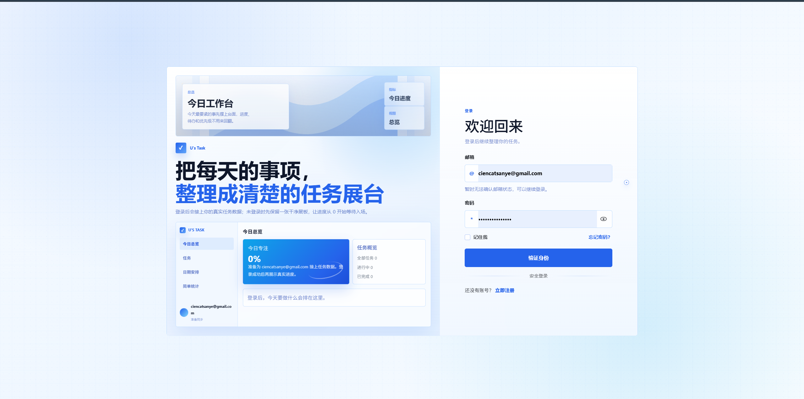

# TaskFlow

<p align="center">
  <a href="https://nextjs.org"></a>
  <a href="https://react.dev"></a>
  <a href="https://www.typescriptlang.org"></a>
  <a href="https://appwrite.io"></a>
  <a href="https://zustand.docs.pmnd.rs"></a>
  <br>
  <a href="#本地运行"></a>
  <a href="./docs"></a>
  
  
</p>
TaskFlow 是一个偏个人任务本风格的小应用，用来把任务记录、筛选排序、截止提醒和进度总览放到同一个地方。

这个项目最初想解决的问题很简单：事情一多，就不只是“记下来”这么简单了，还需要知道哪些任务快到期、哪些正在推进、最近完成了多少，以及接下来应该先看哪一批。TaskFlow 已接入 Appwrite，支持真实账号和任务数据；未配置后端时，会自动使用本地存储维持基础体验。

## 在线预览

- 应用入口：[https://www.uta4k.top/](https://www.uta4k.top/)
- 项目文章：[https://www.uon1ra.top/article/taskflow](https://www.uon1ra.top/article/taskflow)

`/` 是应用入口；如果当前没有登录，会跳转到登录页。

## 项目截图

| 首页                                                               | 总览                                                  |
| ------------------------------------------------------------------ | ----------------------------------------------------- |
|  |  |

| 任务列表                                           | 设置页                                                   |
| -------------------------------------------------- | -------------------------------------------------------- |
|  |  |

## 主要功能

- 邮箱注册、登录、退出登录，以及基于 `httpOnly` cookie 的会话保持
- 任务创建、编辑、删除、状态切换和详情查看
- 按关键词、标签、状态、优先级筛选任务
- 按截止日期、创建时间、更新时间和优先级排序
- 总览支持今天、本周、全部三个观察范围，并同步到 URL
- 任务列表筛选条件同步到 URL，刷新或分享链接后仍能还原视图
- 统计卡片、完成趋势、状态分布、标签分布、近期活动和即将到期提醒
- 逾期、今天到期、3 天内到期等截止风险提示
- 个人资料设置，支持昵称和头像地址更新
- Appwrite 真实数据模式和 localStorage 本地回退自动切换

## 技术栈

- Next.js 16（App Router）
- React 19
- TypeScript 6
- Appwrite
- React Hook Form、Zod、Zustand
- Vitest、Testing Library、Playwright
- Vercel

## 实现思路

项目的核心边界是让浏览器只和当前站点的 Next.js API 通信，再由服务端 API 去访问 Appwrite。这样可以把 Appwrite API Key 留在服务端，同时用站点自己的 `httpOnly` cookie 管理登录态。

任务数据在 Appwrite 中开启了 row-level permissions，每条任务只给当前用户读写权限。前端侧使用 Zustand 管理任务状态：配置了 Appwrite 时会同步远程数据；没有配置时则使用 localStorage 保留本地任务状态。这样项目既能作为完整应用运行，也不会因为缺少后端配置而直接空掉。

项目里我比较在意的几个点：

- 页面状态尽量可恢复：总览范围和任务筛选都放进 URL。
- 任务不只是列表：截止日期、优先级、状态和标签会一起参与排序与提示。
- 后端可选但体验不断：没有 Appwrite 时仍可保留本地任务交互。
- 组件按页面领域拆分：认证、任务、总览、布局和设置各自独立，后续扩展会比较清楚。

## 目录结构

```txt
src/
  app/                  # App Router 页面与 API Route
  features/             # 业务域：auth / tasks / dashboard / calendar / settings / stats
  shared/               # 跨域组件、hooks、providers、lib
  styles/               # 全局与页面样式

docs/
  setup/                # Appwrite 等环境配置
  product/              # URL 协议、UI QA 基线
  career/               # 简历 / 面试 / 项目基线
  testing/              # 测试分层、覆盖率和 CI 说明
  screenshots/          # README 截图
```

## 测试与质量

TaskFlow 当前使用分层测试：Vitest 覆盖日期、排序、统计、Hook、Provider、Zustand Store 和 API Route；Testing Library 覆盖登录、注册和任务表单；Playwright 覆盖登录、鉴权、创建任务等 Mock E2E，并保留一条真实 Appwrite 冒烟流程。

最近一次本地验证结果：

- Vitest：14 个测试文件，71 条测试通过
- Mock E2E：5 条测试通过
- TypeScript 类型检查：通过
- Next.js 生产构建：通过
- V8 覆盖率：Statements 40.85%、Branches 29.43%、Functions 42.81%、Lines 41.36%

核心 Store 模块当前 Statements 覆盖率为 93.18%，任务 Store 的 Lines 覆盖率为 96.96%。整体覆盖率包含认证、任务和 API 目录中的暂未测试模块，因此不以总百分比作为唯一质量指标。

本地运行质量检查：

```bash
pnpm test
pnpm test:coverage
pnpm typecheck
pnpm build
pnpm test:e2e:mock
```

GitHub Actions 会在 push 和 pull request 时自动运行测试、类型检查、生产构建和 Mock E2E。完整测试分层、覆盖率范围和当前缺口见：[docs/testing/taskflow-testing-notes.md](docs/testing/taskflow-testing-notes.md)。

## 本地运行

先安装依赖：

```bash
corepack enable
pnpm install
```

复制环境变量文件：

```bash
cp .env.example .env.local
```

要跑真实账号和真实任务数据，需要补充这些变量：

```bash
NEXT_PUBLIC_APPWRITE_ENDPOINT=https://sgp.cloud.appwrite.io/v1
NEXT_PUBLIC_APPWRITE_PROJECT_ID=xxx
APPWRITE_API_KEY=xxx
APPWRITE_DATABASE_ID=xxx
APPWRITE_TASKS_TABLE_ID=xxx
APPWRITE_SESSION_COOKIE_NAME=taskflow-session
NEXT_PUBLIC_SITE_URL=http://localhost:3000
```

线上部署时，`NEXT_PUBLIC_SITE_URL` 必须换成真实域名，例如：

```bash
NEXT_PUBLIC_SITE_URL=https://www.uta4k.top
```

这个值用于区分本地和线上站点地址。线上环境不要保留 `http://localhost:3000`，否则部署后的站点仍会带着本地配置运行。

启动开发环境：

```bash
pnpm dev
```

浏览器打开 `http://localhost:3000`。应用会尝试进入 `/dashboard`；在 Appwrite 已配置但未登录时，会自动跳转到 `/login`。

构建生产版本：

```bash
pnpm build
pnpm start
```

## Appwrite 配置

Appwrite 需要完成以下配置：

1. 创建 Appwrite Project
2. 添加本地和线上 Web Platform
3. 开启 Email / Password 登录方式
4. 创建 Database
5. 创建 `tasks` table
6. 开启 Row security
7. 创建服务端 API Key
8. 在本地 `.env.local` 或 Vercel 环境变量中填入对应配置

`tasks` table 的字段、权限和 profile 存储方式可以看这份说明：[docs/setup/appwrite-setup.md](docs/setup/appwrite-setup.md)。

## 页面路由

- `/`：应用入口，会尝试进入工作台
- `/login`：登录
- `/register`：注册
- `/dashboard`：任务总览
- `/tasks`：任务列表
- `/tasks/[id]`：任务详情
- `/settings`：个人设置

## 当前状态

目前已经完成 Appwrite 真实数据主链路联调，包含：

- 未登录访问受保护页面会跳转到登录页
- 注册、登录、退出登录
- 读取当前用户信息
- 更新个人资料
- 创建、读取、更新和删除任务
- 总览和任务列表在真实数据下正常同步

## 后续计划

- 给任务增加子任务或备注
- 支持头像上传，而不只是填写图片 URL
- 增加任务导出能力
- 给总览补更多时间维度
- 整理旧兼容字段，让 Appwrite table schema 更干净
